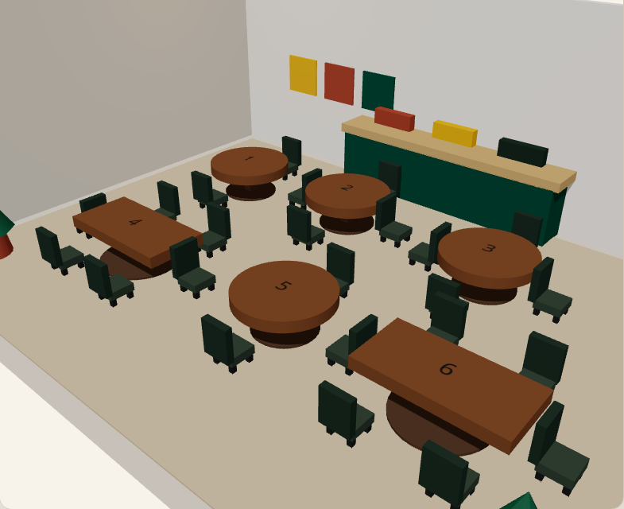

# Luna Dining — 3D Table Reservation

Interactive restaurant floor with **React Three Fiber**. Click a table, complete the booking form, and reservations persist in `localStorage`.

**Portfolio:** https://hawk327ml.github.io/  
**Live (GitHub Pages):** https://hawk327ml.github.io/luna-dining-3d/



## What you can do

- Browse tables with **available / reserved** status in 3D
- Hover for scale feedback; click to select
- Submit name / party size / time via the booking form
- Persist bookings in the browser (`localStorage`) — demo only, no backend

## Stack

| Layer | Tech |
|-------|------|
| UI | React 18, Tailwind, DaisyUI (`luna` theme) |
| 3D | Three.js · `@react-three/fiber` · `@react-three/drei` |
| Build | Vite (`base: './'`) |
| Hosting | **GitHub Pages** (primary) |

## Local

```bash
npm install
npm run dev
```

```bash
npm run build
npm run preview
```

## Deploy

Push to `main` → Actions (`.github/workflows/deploy-pages.yml`) publishes Pages.

### Firebase (optional, currently unused)

`https://luna-dining-3d.web.app` is **not** the active Live (site may 404 until you deploy). If you use Firebase later:

```bash
firebase use daisy-c2db8
firebase deploy --only hosting:luna
```

**Never** run bare `firebase deploy`. Spot-check Rosemary / FocusSpace / Luna Live URLs after any multi-app Hosting change.

## Author

Hawk327ml · Multimedia Computing · UPM
